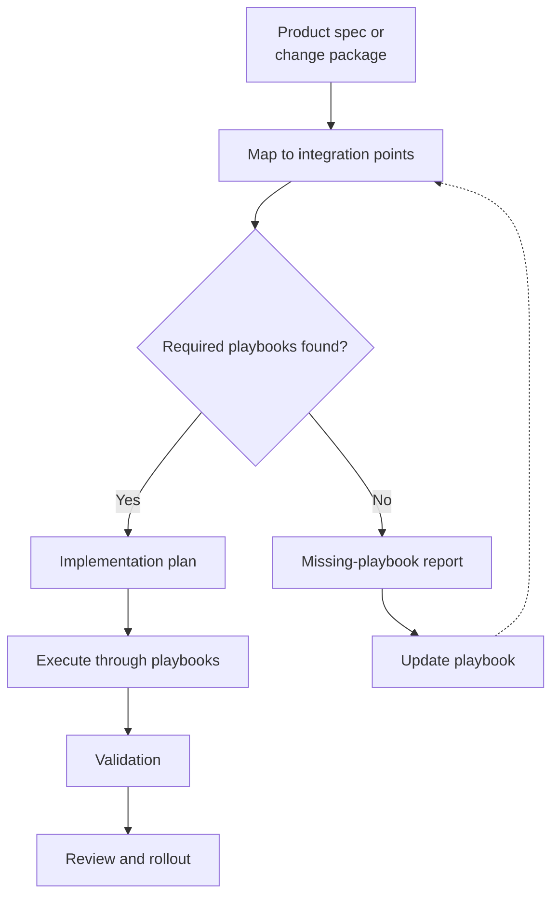

# Code Left

[](LICENSE)
[](https://github.com/MoranM/code-left/actions/workflows/docs.yml)

Skills, playbooks, templates, and operating-model docs for helping teams become more AI-ready.

This repository is built around a simple premise: companies do not become AI-ready by giving everyone a coding agent and hoping for the best. They become AI-ready by making product intent clearer, engineering knowledge more explicit, and production change safer to delegate.

The core idea is **Code-Left**: engineering designs the system by which product intent enters production, so coding agents can implement safely through known seams instead of relying on feature-by-feature human translation.

## Start Here

If you are new to Code-Left, do not start by documenting everything. Start with one narrow pilot.

### Use without cloning

You do not need to clone this repo into your codebase.

From your target repo, ask your coding agent to follow [NL-SPEC.md](NL-SPEC.md) using this repository as the source reference:

```text
I want to set up Code-Left in this repository.
Use https://github.com/MoranM/code-left as the reference.
Follow https://github.com/MoranM/code-left/blob/main/NL-SPEC.md.
Do not clone the Code-Left repo into this codebase.
Create a local Code-Left skills folder for this repo.
Start by inspecting this repo and finding one strong integration-point candidate based on existing codebase conventions.
Do not implement a product feature during setup.
```

### Engineering: make one safe seam

Use this path when your main question is: "How do we let agents implement safely in our repo?"

1. Read [docs/getting-started.md](docs/getting-started.md).
2. Use [templates/engineering/repo-readiness-assessment.md](templates/engineering/repo-readiness-assessment.md) to choose one repeated, low-risk change type.
3. Use [templates/engineering/integration-point-playbook-template.md](templates/engineering/integration-point-playbook-template.md) to document one safe integration point.
4. Load one real product spec into the agent, or wrap it with [templates/engineering/change-package-template.md](templates/engineering/change-package-template.md) if the spec needs a clearer handoff shape.
5. Have the agent map the spec or change package to available integration playbooks before implementation.
6. Update the playbook when the agent exposes missing rules.

### Product: make intent implementation-ready

Use this path when your main question is: "How do we give agents and engineers better product context?"

1. Read [docs/pm-framework/README.md](docs/pm-framework/README.md).
2. Fill or link the three context layers in [templates/pm/](templates/pm/).
3. Draft one bet brief with [templates/pm/bet-brief-template.md](templates/pm/bet-brief-template.md).
4. Assess routing with [skills/pm/assess-work-item-complexity/](skills/pm/assess-work-item-complexity/).
5. Create a technical spec with [templates/pm/technical-spec-template.md](templates/pm/technical-spec-template.md) when the work needs one.

### Recommended first pilot

For a full Code-Left pilot, combine both tracks:

- Product creates one clear spec, bet brief, or change package.
- Engineering creates one integration-point playbook.
- The agent maps the product intent to available playbooks before implementation.
- If the required playbook is missing, the agent stops and reports the missing integration coverage.
- The team updates the playbook after review.

For deeper adoption, see [docs/implementation-guide.md](docs/implementation-guide.md).

## How Code-Left Works



## Repo Map

| Need | Start here |
| --- | --- |
| Install local skills without cloning | [NL-SPEC.md](NL-SPEC.md) |
| First pilot | [docs/getting-started.md](docs/getting-started.md) |
| Deeper implementation guidance | [docs/implementation-guide.md](docs/implementation-guide.md) |
| Worked first-pilot example | [examples/first-pilot/](examples/first-pilot/) |
| Product context and bets | [docs/pm-framework/](docs/pm-framework/) |
| Engineering templates | [templates/engineering/](templates/engineering/) |
| Product templates | [templates/pm/](templates/pm/) |
| Agent skills | [skills/](skills/) |

## What This Repo Is

This repo is a working library for teams that want to move from ad hoc AI usage to a repeatable AI-assisted delivery model.

It contains:

- A natural-language setup spec for installing a local Code-Left skills bundle without cloning this repo.
- A manifesto and playbook for the Code-Left operating model.
- Product-side docs for turning ideas into clear bets.
- Product templates for context, briefs, complexity checks, and technical specs.
- Engineering templates for integration points, readiness, validation, and escalation.
- Agent skills that encode repeatable workflows for product and engineering.

The goal is not to replace engineers with agents. The goal is to help engineering teams package their judgment into systems, rules, contracts, and workflows that make agent-assisted implementation safer and more scalable.

## The Core Thesis

AI coding agents make one thing obvious: the hard part of software delivery was never just typing code.

The hard part is integration:

- knowing where a change belongs
- understanding which existing patterns must be reused
- respecting architecture and domain boundaries
- adding the right observability and failure handling
- knowing when a change is safe, and when it needs escalation

In many organizations, that knowledge lives in engineers' heads. That does not scale when agents start participating in delivery.

Code-Left externalizes that knowledge into practical assets:

- architecture rules
- extension-point playbooks
- product specs or change packages
- agent instruction sets
- validation checklists
- escalation policies
- repeatable skills and workflows

## Operating Model

In the Code-Left model:

- **Product owns product intent.**
- **Agents own implementation execution.**
- **Engineering owns the system of safe integration.**

Engineering's system includes extension points, contracts, templates, instruction layers, validation steps, policy checks, review triggers, and deployment guardrails.

The result is not less engineering. It is higher-leverage engineering.

## Repository Contents

### `code-left.md`

The main manifesto and playbook for Code-Left. It explains the operating model, the engineering role, the product role, and the minimum structure for integration playbooks.

### `docs/`

Guides for adopting Code-Left:

- [docs/getting-started.md](docs/getting-started.md) - the simplest first pilot path.
- [docs/implementation-guide.md](docs/implementation-guide.md) - deeper guidance for building a Code-Left-ready repo.
- [docs/pm-framework/](docs/pm-framework/) - the product-side bet and context framework.

### `examples/`

Worked examples that show what Code-Left artifacts look like when filled in. Start with [examples/first-pilot/](examples/first-pilot/).

### `templates/pm/`

Product-side templates for context layers, bet briefs, complexity assessment, technical specs, analytics context, and source inventory. Start with [templates/pm/README.md](templates/pm/README.md).

### `templates/engineering/`

Engineering-side templates for turning repo knowledge into safe integration structure. Start with [templates/engineering/README.md](templates/engineering/README.md).

For first setup, use only:

1. [repo-readiness-assessment.md](templates/engineering/repo-readiness-assessment.md)
2. [integration-point-playbook-template.md](templates/engineering/integration-point-playbook-template.md)
3. [change-package-template.md](templates/engineering/change-package-template.md)

The remaining engineering templates are optional and should be used after the first pilot exposes repeated needs.

### `skills/`

Portable markdown instruction sets for coding agents. The repo stores source copies under `skills/`; teams can copy or adapt them into the skill path used by their agent tool, such as `<agent-config>/skills/...`.

Useful starting skills:

- [skills/setup-code-left/](skills/setup-code-left/) - install a local Code-Left skills bundle in a target repo.
- [skills/pm/map-product-context/](skills/pm/map-product-context/) - map product context sources.
- [skills/pm/build-product-brief/](skills/pm/build-product-brief/) - draft or improve a product bet brief.
- [skills/pm/assess-work-item-complexity/](skills/pm/assess-work-item-complexity/) - route work by complexity and risk.
- [skills/pm/build-technical-spec/](skills/pm/build-technical-spec/) - produce an implementation-ready spec.
- [skills/map-integration-candidates/](skills/map-integration-candidates/) - find strong engineering integration-point candidates in a repo.
- [skills/build-integrate-skill/](skills/build-integrate-skill/) - create a repo-specific integration orchestrator skill.

## Adoption Paths

### Engineering and integration

1. Choose one high-repetition, low-risk change type.
2. Document the allowed integration point.
3. Provide one real product spec, or wrap it in a change package.
4. Have the agent map the spec or package to available playbooks before implementation.
5. Stop if the required playbook is missing instead of inventing an implementation path.
6. Define validation and review rules only when the pilot shows they need to be explicit.
7. Convert repeated mistakes into stronger rules, templates, or checks.
8. Expand to the next change type.

### Product and context

1. Map existing context sources with [skills/pm/map-product-context/](skills/pm/map-product-context/).
2. Stand up the three context layers using [templates/pm/](templates/pm/).
3. Run one real bet through **build-product-brief** -> **assess-work-item-complexity** -> **build-technical-spec**.

Product supplies implementation-ready intent. Engineering supplies safe integration. Agents execute inside those boundaries.

## What AI-Ready Means Here

An AI-ready company is not a company where agents can change anything.

An AI-ready company is one where common change types are explicit enough that agents can operate inside clear boundaries.

A repo is becoming AI-ready when:

- common change types have known integration points
- engineering rules are written down and reusable
- product specs include behavior, edge cases, non-goals, and acceptance criteria
- agents can identify the right playbook for a requested change
- tests and policy checks match the type of change being made
- human review focuses on risk and exceptions, not reconstructing missing context

A repo is not AI-ready when every task begins with repo archaeology, undocumented conventions, and a senior engineer manually catching the same mistakes over and over.

## Principles

### Product intent should be structured

Specs should include scope, non-goals, invariants, user-facing behavior, acceptance criteria, and edge cases.

### Architecture should expose safe seams

Agents perform better when systems have clear extension points, stable contracts, and explicit ownership boundaries.

### Guardrails should be part of the workflow

Tests, schemas, lint rules, permission checks, observability, feature flags, and rollout controls are part of the execution model, not cleanup after implementation.

### Engineers should encode judgment

Engineering remains essential. The center of gravity moves from manually implementing every request toward designing the system that makes safe implementation repeatable.

### Agents should operate inside boundaries

Autonomy should be granted by change type, risk level, and validation strength. Some changes can be highly automated. Others require engineer review or architecture escalation.

## What This Is Not

This repo is not about:

- PMs replacing engineers
- agents coding from vague tickets
- unrestricted autonomy inside production repos
- faster prototyping without production discipline
- skipping architecture, review, tests, or rollout safety

If anything, Code-Left requires stronger engineering discipline because the path from product artifact to production becomes more direct.

## Future Direction

This repo can grow into a practical library of AI-readiness assets, including:

- integration playbooks by change type
- reusable agent skills for product, design, engineering, and review workflows
- company readiness assessments
- spec and POC evaluation rubrics
- agent review checklists
- architecture rule templates
- production safety policies
- examples of AI-ready repo structures
- training material for PM and engineering pairs
- more setup and adoption skills for common Code-Left rollout paths

## The Operating Agreement

Code-Left means engineering designs the system by which product intent enters production, so coding agents can implement safely through known seams instead of relying on feature-by-feature human translation.

That is the shift:

- not less engineering
- different engineering
- higher-leverage engineering
