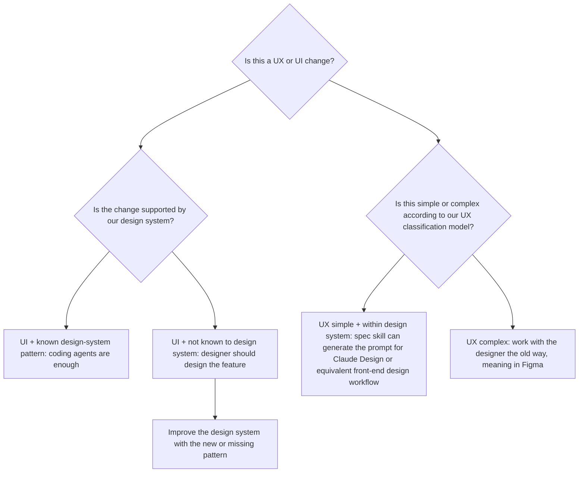

# UX / UI Design-Path Rubric

Use this rubric whenever [`assess-work-item-complexity`](./SKILL.md) runs. It classifies the design dimension of a work item and tells the PM what to do next before implementation.

The design-path recommendation is separate from engineering routing. Engineering routing still decides whether the work should be handled by a coding agent, PM self-serve, engineering workflow, or engineering handoff. This rubric tells the PM whether the design dimension is ready for that path.

## Logic Flow



## Step 1: Nature Of Change

Classify the work item as one of:

| Classification | Definition | Examples |
| --- | --- | --- |
| **UI-dominant** | Changes what users see inside an existing flow. The user journey, decision model, and information architecture stay materially the same. | Restyle a card, adjust spacing, change copy, add a banner, swap an icon, update an existing empty state. |
| **UX-dominant** | Changes how users think, navigate, decide, or complete a task. It affects flow, information architecture, user mental model, or behavior. | New user journey, changed onboarding flow, restructured navigation, new decision point, changed role behavior. |
| **Mixed** | Both UX and UI are materially affected. Neither side is incidental. | New tab with a new flow and new layout, redesigned page that changes hierarchy and visual patterns. |

Pick one and provide a one-line rationale. If uncertain, choose `Mixed` and mark the uncertainty as `[INFERRED]`.

## Step 2: Design-System Gate

Determine whether the UI work is supported by the team's existing design system or established app patterns.

| Coverage | Definition |
| --- | --- |
| **Known pattern** | Required components, tokens, states, and layout conventions already exist in the product or design system. |
| **Partial / unsure** | Most of the work maps to known patterns, but one or two parts are new or the agent cannot confirm coverage. Mark `[INFERRED]` and state what is uncertain. |
| **Unknown / net new** | The work requires visual patterns, components, interactions, or layouts that do not exist today. A designer should define the pattern before implementation. |

Use this checklist. If any answer is No or Unsure, coverage is at most `Partial / unsure`.

- [ ] Required UI components map to existing product or design-system primitives.
- [ ] Color, spacing, typography, and layout use existing tokens or conventions.
- [ ] Page structure follows an established pattern.
- [ ] No net-new icon set, illustration style, motion pattern, or interaction pattern is required.

If coverage is `Unknown / net new`, include this PM action: designer should define the feature pattern, and the team should improve the design system with the missing pattern.

## Step 3: UX Complexity

Apply this step only to `UX-dominant` and `Mixed` work.

For `UI-dominant` work, record:

> N/A - UI-only; no flow, information architecture, or behavior change.

For UX work, use Section 0 of the Code-Left reference bet brief, [`bet-brief-template.md`](../../../templates/pm/bet-brief-template.md):

| Criterion | Simple | Complex |
| --- | --- | --- |
| **Scenarios** | 1-2 clear, linear scenarios | 3+ scenarios with branching paths |
| **Flow impact** | Small correction to an existing flow | New flow or major restructure |
| **Information architecture** | Same IA with minor additions | Challenges or restructures existing IA |

Decision rule: all three Simple means `Simple`. Any one Complex means `Complex`.

If the brief has UX complexity filled in, use it. If not, infer with `[INFERRED]` and list unknowns.

## PM Design Recommendation

Use the outputs above to recommend a PM action:

| Nature | Design-system coverage | UX complexity | PM design recommendation |
| --- | --- | --- | --- |
| **UI-dominant** | Known pattern | N/A | **Coding agent is enough** for the design dimension. Proceed with normal routing and review. |
| **UI-dominant** | Partial / unsure | N/A | **Designer review**. Designer confirms the uncertain pattern, then implementation can proceed. |
| **UI-dominant** | Unknown / net new | N/A | **Designer designs the feature**. Feed the missing pattern back into the design system. |
| **UX-dominant** | Known pattern | Simple | **Spec skill + Claude Design / equivalent front-end design workflow**. No Figma phase needed by default. |
| **UX-dominant** | Partial / unsure | Simple | **Designer review**. Designer confirms the UX and design-system fit, then spec work can proceed. |
| **UX-dominant** | Any | Complex | **Designer + Figma**. Work with design the traditional way before implementation. |
| **Mixed** | Known pattern | Simple | **Spec skill + Claude Design / equivalent front-end design workflow**. Treat as simple UX with known patterns. |
| **Mixed** | Partial / unsure | Simple | **Designer review**. Resolve the uncertainty before implementation. |
| **Mixed** | Any | Complex | **Designer + Figma**. Work with design the traditional way before implementation. |

## Reconcile With Engineering Routing

Always present both recommendations:

- **Engineering routing:** coding agent, PM self-serve, engineering workflow, or hand to engineering.
- **PM design action:** the recommendation from this rubric.

The PM design action does not override engineering routing. If engineering routing says `Hand to engineering`, that remains primary even when the design path is simple. If engineering routing says `Coding agent` but this rubric says `Designer + Figma`, the PM should involve design before handing work to a coding agent.

## Output Format

Include this block in quick assessments and full assessment files:

```markdown
### Design path

- **Nature:** [UI-dominant | UX-dominant | Mixed] - [one-line rationale]
- **Design-system coverage:** [Known pattern | Partial / unsure | Unknown / net new] - [one-line rationale]
- **UX complexity:** [Simple | Complex | N/A] - [one-line rationale]
- **PM design recommendation:** [Coding agent is enough | Designer review | Designer designs the feature | Spec skill + Claude Design / equivalent front-end design workflow | Designer + Figma]
- **PM action:** [what the PM should do next]
```
