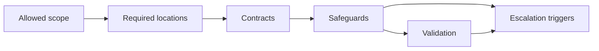

# Integration point playbook: [name]

Use this template to define one safe seam for agent-assisted implementation.

## Purpose

What kind of change this playbook handles.

## Use when

Use this playbook for requests like:

- [example]
- [example]

## Do not use when

Do not use this playbook when:

- [case that requires another playbook]
- [case that requires escalation]

## Allowed scope

Agents may change:

- [files/modules/behaviors]

Agents may not change:

- [files/modules/behaviors]

## Required locations

Where new files, registrations, tests, configs, routes, jobs, or related changes belong.

| Need | Location or pattern |
| --- | --- |
| Implementation | [path/pattern] |
| Registration | [path/pattern] |
| Tests | [path/pattern] |
| Docs/config | [path/pattern] |

## Required contracts

Define the inputs, outputs, schemas, lifecycle rules, and ownership boundaries that must be preserved.

- [contract]
- [contract]

## Required safeguards

List safeguards that are mandatory for this change type.

- Permissions: [rule]
- Validation: [rule]
- Error handling: [rule]
- Logging/metrics: [rule]
- Feature flag or rollout: [rule]
- Idempotency/retry behavior: [rule, if relevant]

## Reuse expectations

Agents should prefer:

- [existing component/service/helper/pattern]
- [canonical example path]

Agents should avoid:

- [anti-pattern]
- [duplicate implementation]

## Escalation triggers

The agent must stop and ask for review if:

- [trigger]
- [trigger]
- [trigger]

## Validation checklist

Before completion, run:

- [command/check]
- [command/check]

Manual review needed:

- [review item, if any]

## Completion report

The agent should report:

- what changed
- which files were touched
- which validations ran
- what remains off by default, if anything
- known gaps or review needs
